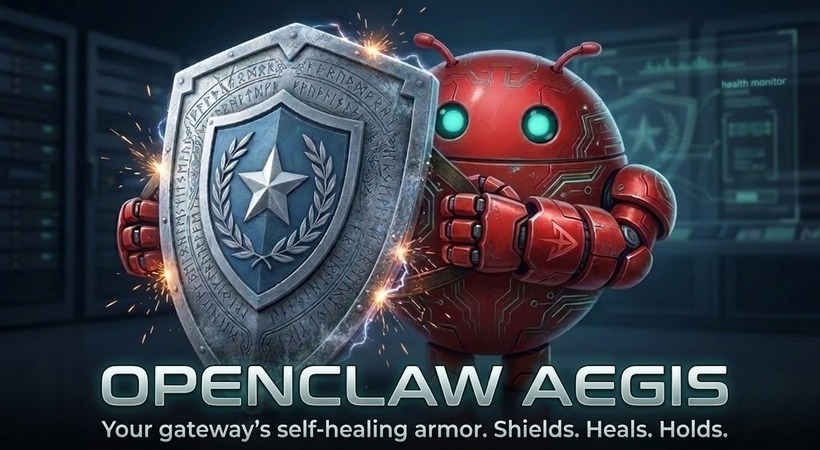

<p align="center">
  
</p>

<p align="center">
  <a href="https://www.npmjs.com/package/openclaw-aegis"></a>
  <a href="https://github.com/Canary-Builds/openclaw-aegis/actions/workflows/ci.yml"></a>
  <a href="https://nodejs.org"></a>
  <a href="LICENSE"></a>
</p>

---

## The Armor Your Gateway Deserves

When your OpenClaw gateway goes down, **everything goes dark** — Telegram, WhatsApp, all channels. Silent. No alerts, no warnings, nothing. If a bad config caused the crash, restarting won't help. The `.bak` files carry the same poison. You only find out hours later when someone asks why messages stopped.

**Aegis doesn't let that happen.**

It stands between your gateway and disaster — a tireless sentinel that detects failures in seconds, diagnoses the root cause, repairs what it can, and alerts you through channels that bypass the gateway entirely.

### What It Does

| | |
|---|---|
| **Detects** | 10 health probes scan process, port, HTTP, config, WebSocket, TUN, memory, CPU, disk, and logs every 10 seconds |
| **Diagnoses** | 6 failure pattern matchers identify poison configs, stale PIDs, port conflicts, permission errors, corruption, and OOM kills |
| **Heals** | L1 restart, L2 targeted repair, L3 deep repair (network, dependencies, safe mode, disk), config rollback — all automatic |
| **Alerts** | 8 out-of-band providers (ntfy, Telegram, WhatsApp, Slack, Discord, Email, Pushover, webhook) that work even when the gateway is dead |
| **Responds** | Message `/health` on Telegram, WhatsApp, Slack, or Discord — Aegis replies with real-time status |
| **Remembers** | Full incident timeline, MTTR tracking, and a 18-endpoint REST API for dashboard integration |

**Total downtime: ~15 seconds instead of hours.**

---

## Quick Start

Three commands. That's it.

```bash
# Deploy the shield
npm install -g openclaw-aegis

# Auto-detect your gateway — zero questions asked
aegis init --auto

# Confirm the shield is up
aegis check
```

```
Health: HEALTHY (score: 10)
Probes: 10 passed, 0 failed
```

Your gateway is now protected.

---

## Arsenal

| Command | What It Does |
|---------|-------------|
| `aegis init` | Interactive setup — walks you through everything |
| `aegis init --auto` | Zero-config setup — detects gateway, sets defaults |
| `aegis check` | Run all 10 probes, get a health verdict |
| `aegis check --json` | Machine-readable output for scripts and monitoring |
| `aegis status` | Live dashboard — every probe, color-coded |
| `aegis test-alert` | Fire a test alert to all configured channels |
| `aegis incidents` | Browse past battles — what failed, what was fixed |
| `aegis incidents <id>` | Full incident timeline with every recovery step |
| `aegis serve` | Start REST API + bot listeners for dashboard integration |

---

## Defense Architecture

```
OpenClaw Gateway                  Aegis Sidecar
┌─────────────────────┐          ┌──────────────────────────────┐
│                     │          │  Health Monitor (10 probes)  │
│  ~/.openclaw/       │◄────────►│  Config Guardian             │
│    openclaw.json    │          │  Dead Man's Switch           │
│    logs/            │          │  Recovery Orchestrator        │
│                     │          │    L1: Quick Restart         │
│  systemd/launchd    │◄─────────│    L2: Targeted Repair       │
│                     │          │    L3: Deep Repair           │
│                     │          │    L4: Human Alert           │
└─────────────────────┘          │  Alert Dispatcher            │
                                 │  (8 out-of-band providers)   │
                                 └──────────────────────────────┘
                                          │
                                    Out-of-band
                                    (never through
                                     the gateway)
                                          │
                                          ▼
                                      Your phone
```

Alerts bypass the gateway entirely. If the gateway is down, Aegis talks directly to Telegram, Slack, Discord, and the rest. **No single point of failure.**

---

## Recovery Cascade

When Aegis detects a problem, it doesn't just restart and pray:

**L1 — Quick Restart** (5s) — Pre-flight config check first. If config is clean, restart with exponential backoff. If config is poisoned, skip straight to L2.

**L2 — Targeted Repair** (30s-2min) — Diagnose the exact failure pattern and apply the right fix. Restore known-good config, delete stale PID files, fix permissions.

**L3 — Deep Repair** (30s-2min) — Riskier fixes when L2 isn't enough. Network repair (DNS flush, TUN reset), process resurrection (reinstall binary), dependency rebuild, safe mode boot, and disk cleanup.

**L4 — Human Alert** (instant) — When auto-recovery fails, Aegis sends a full incident report through every configured channel. You get the health score, what was tried, and why it failed.

Anti-flap protection, circuit breakers, and exponential backoff prevent crash loops. Aegis won't make things worse.

---

## Documentation

| Document | Description |
|----------|-------------|
| [Getting Started](docs/getting-started.md) | Installation, first setup, verification |
| [Architecture](docs/architecture.md) | Probe pipeline, recovery tiers, system design |
| [Configuration](docs/configuration.md) | Full TOML reference — every knob and dial |
| [Alerts](docs/alerts.md) | Setup guides for all 8 providers |
| [CLI Reference](docs/cli-reference.md) | Every command with examples |
| [Contributing](docs/contributing.md) | Dev setup, testing, PR process |
| [Releasing](docs/releasing.md) | Version bumps, npm publish, GitHub releases |
| [Roadmap](docs/roadmap.md) | What's coming — L3 recovery, observability, fleet management |

---

## Requirements

- **Node.js** >= 18
- **OpenClaw Gateway** (any version with `openclaw gateway health`)
- **Linux** (systemd) or **macOS** (launchd)

---

## License

MIT — see [LICENSE](LICENSE).

Built by [Canary Builds](https://canarybuilds.com).
